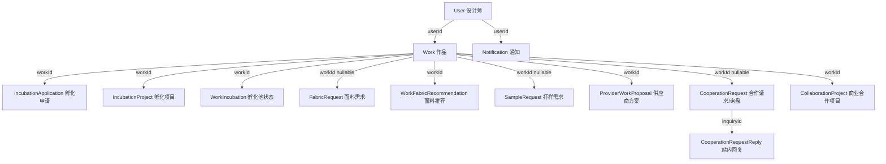

# RunwayLab V2.0B.4.2 项目进度工作台审计

当前稳定基线：`9c5e72afc97202c72100baebc747b5c55297e812`

## 1. 现有数据结构图

## 2. 当前哪些数据库对象已经可以组成项目

可以组成项目的核心对象是 `Work`。每个设计师项目第一版应以一件作品为锚点聚合：`IncubationApplication`、`IncubationProject`、`WorkIncubation`、`FabricRequest`、`WorkFabricRecommendation`、`SampleRequest`、`ProviderWorkProposal`、`CooperationRequest`、`CooperationRequestReply`、`Notification` 和现有 `CollaborationProject`。

不建议以 `CollaborationProject` 作为第一版项目根对象，因为它属于 Marketplace/商业项目系统，且功能开关 `feature.project_marketplace_v22` 关闭时详情页会显示“尚未开放”。本轮应避免开启 Marketplace V2.2。

## 3. 当前项目状态分别保存在哪里

| 对象 | 状态字段 | 含义 |
| --- | --- | --- |
| `Work` | `reviewStatus`, `contentStatus`, `incubationStatus`, `wantsFabric`, `wantsSample`, `wantsIncubation` | 作品审核、上下架和意向信号 |
| `WorkIncubation` | `status` | 公共孵化池展示状态 |
| `IncubationApplication` | `status` | 设计师或后台触发的孵化申请审核状态 |
| `IncubationProject` | `status`, `nextAction`, `platformComment` | 后台维护的孵化项目进度和下一步 |
| `FabricRequest` | `status` | 设计师面料需求处理状态 |
| `WorkFabricRecommendation` | `status` | 平台或服务商面料推荐状态 |
| `SampleRequest` | `status` | 设计师打样需求处理状态 |
| `ProviderWorkProposal` | `status`, `type` | 服务商给作品的面料、打样、生产等方案状态 |
| `CooperationRequest` | `status`, `providerId`, `workId` | 公开合作请求和发给服务商的询盘状态 |
| `Notification` | `isRead`, `type`, `linkUrl` | 辅助事件与跳转，不是核心业务状态 |
| `CollaborationProject` | `status` | 已进入商业项目后的状态 |

## 4. 是否存在重复状态

存在重复或近似表达：

- 孵化状态同时存在于 `Work.incubationStatus`、`WorkIncubation.status`、`IncubationApplication.status`、`IncubationProject.status`。
- “方案/请求处理”同时使用 `ProposalStatus`、`ProviderWorkProposalStatus` 和 `RequestStatus`。
- `CooperationRequest` 同时承载作品公开合作请求和服务商询盘，需通过 `providerId` 区分。
- `/me/incubation` 已经按作品展示一部分进展，但它混合了批次、预售、AI 建议、面料推荐和服务商方案，缺少统一项目视图。

## 5. 是否存在孤立记录

存在可预期的孤立或弱关联记录：

- `FabricRequest.workId`、`SampleRequest.workId`、`CooperationRequest.workId` 均允许为空，无法归入某个作品项目，只能在独立需求列表中保留。
- `Notification` 没有结构化 `targetType/targetId`，只能通过 `linkUrl` 作为辅助归类，不能用来反推阶段。
- `CollaborationProject` 可以关联 work，但属于独立商业项目系统，不应成为本轮新的根模型。

## 6. 是否能够不修改 Prisma schema 完成第一版

可以。第一版用代码层计算统一阶段，不新增 Prisma enum，不新增表，不新增 migration。缺点是阶段不可直接在数据库筛选，但符合本轮轻量聚合目标。

## 7. 统一阶段映射

| 统一阶段 | 真实状态来源 |
| --- | --- |
| `WORK_PUBLISHED` | `Work` 已存在，展示作品审核/可见状态 |
| `INCUBATION_CANDIDATE` | `Work.wantsIncubation`、`IncubationApplication.CANDIDATE/REVIEWING`、`WorkIncubation.CANDIDATE` |
| `INCUBATION_CONFIRMED` | `IncubationApplication.ACCEPTED` 或 `IncubationProject` 存在 |
| `FABRIC_REQUIREMENT` | 存在未结束的 `FabricRequest` |
| `FABRIC_MATCHING` | 存在待处理或感兴趣的 `WorkFabricRecommendation`，或孵化状态为面料匹配 |
| `FABRIC_SELECTED` | 存在 `WorkFabricRecommendation.ACCEPTED` |
| `SAMPLE_REQUESTED` | 存在未结束的 `SampleRequest` |
| `PROPOSAL_RECEIVED` | 存在待查看/备选的 `ProviderWorkProposal` |
| `COOPERATION_CONFIRMED` | 存在已采纳方案、已完成询盘，或 `CollaborationProject` 进入合作 |
| `SAMPLE_IN_PROGRESS` | `IncubationProject.status` 为 `SAMPLE_MAKING/SAMPLE_EVALUATING` |
| `SAMPLE_REVIEW` | `IncubationProject.status` 为 `QUOTE_DISCUSSING/PATTERN_EVALUATING` |
| `MARKET_VALIDATION` | 第一版不主动启用 Preorder/Marketplace，仅保留映射位 |
| `COMPLETED` | `IncubationProject.COMPLETED` 或合作项目完成 |
| `CANCELLED` | 作品下架/删除/审核拒绝，或相关项目取消 |

## 8. 页面信息架构

`/me/projects` 应改为设计师项目进度总览：

- 作品封面、标题、当前阶段、当前状态。
- 下一步行动、等待对象、待处理数量、最近更新时间、相关通知数量。
- 入口链接只指向现有真实操作页面，例如作品详情、面料需求、打样需求、询盘、通知。

`/me/projects/[id]` 应改为基于 `Work.id` 的项目详情：

- 阶段进度条和当前状态说明。
- 唯一主行动按钮。
- 待处理任务。
- 面料需求、面料推荐、打样需求、供应商方案、合作请求、询盘。
- 真实项目时间线，来源为业务对象的 createdAt/updatedAt。
- 相关通知，只作为辅助事件展示。

## 9. 权限矩阵

| 角色 | `/me/projects` | `/me/projects/[id]` | 后台孵化 | 供应商询盘/方案 |
| --- | --- | --- | --- | --- |
| 未登录 | 重定向登录 | 重定向登录 | 禁止 | 禁止 |
| 设计师 | 只能看 `Work.userId = self.id` 的项目 | 只能看自己的作品项目 | 禁止 | 可看自己发出的询盘 |
| 供应商 | 不能看到无关设计师项目 | 不能通过 id 访问无关作品项目 | 禁止 | 只能看自己 providerId 的询盘/方案 |
| 管理员 | 保持现有后台权限 | 保持现有后台权限 | 可管理 | 可管理 |

## 10. 下一步行动决策表

| 条件 | 下一步行动 | 等待对象 |
| --- | --- | --- |
| 作品未通过审核或已下架 | 查看作品状态/修改作品 | 设计师 |
| 无孵化申请且希望孵化 | 查看孵化入口 | 设计师 |
| 已申请孵化未处理 | 等待平台审核 | 平台 |
| 无面料需求且无面料推荐 | 提交面料需求 | 设计师 |
| 有待处理面料推荐 | 查看面料推荐 | 设计师 |
| 有已采纳面料但无打样需求 | 提交打样需求 | 设计师 |
| 有打样需求未处理 | 等待平台/服务商 | 平台/服务商 |
| 有供应商方案待查看 | 查看供应商方案 | 设计师 |
| 有服务商询盘回复 | 继续站内沟通 | 设计师 |
| 有合作请求/询盘推进中 | 跟进合作 | 双方 |

## 11. 时间线事件来源

时间线只能来自真实对象：

- `Work.createdAt/updatedAt`
- `IncubationApplication.createdAt/updatedAt/handledAt`
- `IncubationProject.createdAt/updatedAt/handledAt`
- `FabricRequest.createdAt/updatedAt/handledAt`
- `WorkFabricRecommendation.createdAt/updatedAt`
- `SampleRequest.createdAt/updatedAt/handledAt`
- `ProviderWorkProposal.createdAt/updatedAt`
- `CooperationRequest.createdAt/updatedAt/viewedAt/respondedAt/handledAt`
- `CooperationRequestReply.createdAt`
- `Notification.createdAt`

通知只显示“相关事件”，不参与阶段计算。

## 12. 设计师当前最容易迷失的页面

- `/me` 的“我的进展”只给入口卡片，没有按作品合并下一步。
- `/me/incubation` 信息很多，混合 AI、批次、预售、推荐和方案，缺少统一主行动。
- `/works/[id]` 有推荐/方案/需求入口，但设计师需要记住每个作品的状态。
- `/me/inquiries` 单独展示服务商询盘，和作品孵化链路割裂。
- `/notifications` 只按消息流呈现，无法成为项目状态来源。

## 13. 哪些操作应进入项目工作台

- 查看作品。
- 提交面料需求。
- 提交打样需求。
- 查看面料推荐。
- 查看服务商方案。
- 查看/继续服务商询盘。
- 查看通知。
- 查看孵化进展。

第一版使用链接复用现有操作页面，不新建状态写入入口。

## 14. 哪些管理操作必须继续留在后台

- 审核作品、上下架、删除。
- 设置孵化池状态。
- 审核/处理孵化申请。
- 管理面料需求和打样需求处理状态。
- 创建或编辑后台服务商方案。
- 管理供应商、案例、面料生命周期。
- 处理违规、举报、风控和平台备注。

## 15. 如何避免新建第二套 Project 系统

- 不新增 `Project` 表、enum 或 migration。
- `/me/projects` 作为“设计师项目工作台”页面名，但数据根对象仍是 `Work`。
- `CollaborationProject` 只作为已进入合作后的一个阶段信号，不替代 Work 锚点。
- 阶段使用代码层 `ProjectWorkbenchStage` union 类型计算，未来如需持久化再单独评审 schema。

## 16. 风险

- `Notification` 缺少结构化目标字段，相关通知只能通过 linkUrl 粗略归类。
- 空 workId 的需求无法归入作品项目，第一版应留在原有需求页。
- `Work.incubationStatus`、`WorkIncubation.status` 和 `IncubationProject.status` 可能互相不一致，统一阶段需按优先级计算。
- 现有 `/me/projects` 曾承载 Marketplace 个人项目，改为工作台会改变页面语义，但不启用 Marketplace。
- 自由文本可能含联系方式，项目工作台需要统一脱敏。

## 17. 实施文件清单

预计新增：

- `src/lib/project-workbench.ts`
- `scripts/project-workbench-tests.ts`

预计修改：

- `src/app/me/projects/page.tsx`
- `src/app/me/projects/[id]/page.tsx`
- `src/app/me/page.tsx`

不修改：

- `prisma/schema.prisma`
- `prisma/migrations/*`
- `package.json`
- `package-lock.json`
- 支付、短信、登录、部署相关文件

## 18. 测试计划

- 新增项目工作台阶段映射测试。
- 新增权限隔离与 N+1 结构静态测试。
- 新增隐私脱敏测试。
- 运行 `npx prisma validate`。
- 运行 `npx tsc --noEmit`。
- 运行 `npm run build`。
- 运行全部现有 `scripts/*tests.ts` 回归测试。
